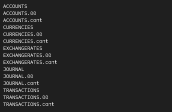
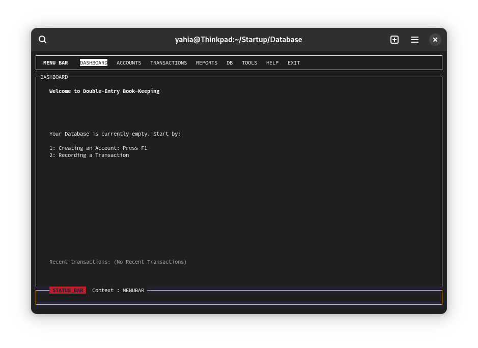
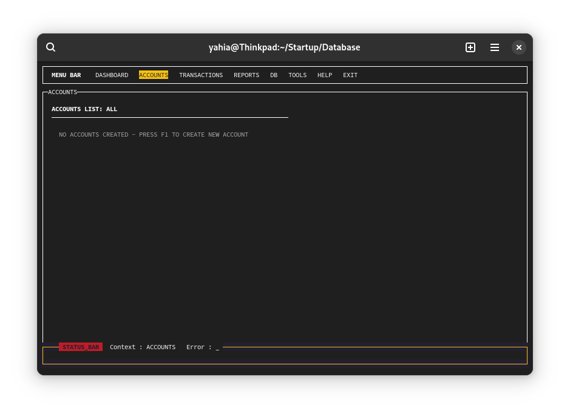
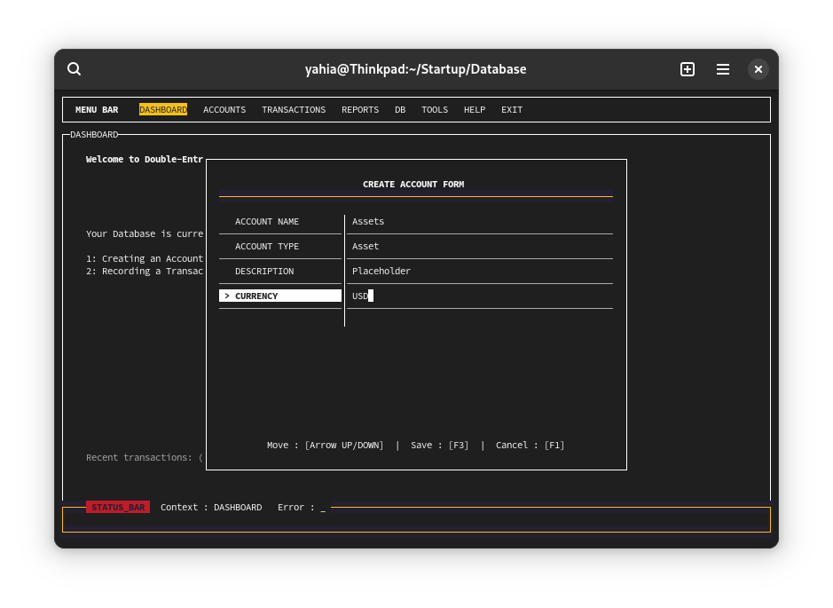

---

# BookKeeper: The Super Stupid Book Keeper Program

BookKeeper is a **double-entry bookkeeping system** designed to be **simple, efficient, and extensible**. It follows the **KISS (Keep It Stupid Simple)** principle, making it easy to understand, modify, and use. The program is currently under active development and integrates with a **non-custodial cryptocurrency wallet** (inspired by Trust Wallet Core) but written in C.

I invite those interested in creating not just a bookkeeping system but a modular easy to modify DBMS - NPL - TUI framework to join me.

---

## Features

- **Double-Entry Accounting**: Tracks debits and credits with precision.
- **Custom Database Management System (DBMS)**: Built from scratch using the **AI Stevens C database development style**.
- **Terminal User Interface (TUI)**: Powered by `ncurses` and `panel` libraries for an intuitive, text-based interface.
- **Non-Custodial Wallet Integration**: Designed to work seamlessly with a cryptocurrency wallet (currently in development).
- **Extensible Design**: Modular architecture for adding features like concurrency, networking, and natural language processing.

---

## Current Status

BookKeeper is **under serious development**. Here's what's working and what's planned:

### Completed
- **Core DBMS**: Basic database operations (create, read, update, delete).
- **Data Definition Language (DDL) Compiler**: Compiles `.sch` schema files into the database structure.
- **Database Initialization**: Creates and initializes the database directory.
- **TUI Framework**: Basic terminal interface for interacting with the database.

### In Progress
- **Error Logging Module**: Improving error handling and logging.
- **DBMS Library**: Enhancing functionality and performance.
- **TUI Development**: Building out the user interface for accounting operations - Dynamic table for Database presentation.

### Planned Features
- **Concurrency Daemon**: Support for concurrent database access.
- **Network Utilities**: Remote database access and synchronization.
- **Security Utilities**: Encryption and user authentication.
- **Multiuser Design**: Support for multiple users with role-based access.
- **DBMS Caching**: Improve performance with in-memory caching.
- **Non-Custodial Wallet Utilities**: Integrate with a cryptocurrency wallet.
- **Natural Language Processing (NLP)**: Simplify querying and input with NLP.

---

## File Structure

The project consists of the following files:

| File               | Description                                                                 |
|--------------------|-----------------------------------------------------------------------------|
| `README.md`        | This file. Explains the program and how to use it.                          |
| `bookkeeper.sch`   | Schema file defining the relational database structure.                     |
| `btree.c` / `btree.h` | B-tree implementation for indexing and fast lookups.                      |
| `dbinit.c`         | Database initialization program.                                            |
| `dfile.c` / `dfile.h` | File management utilities for the DBMS.                                   |
| `dml.c` / `dml.h`  | Data Manipulation Language (DML) operations (insert, update, delete, etc.). |
| `logfile.c` / `logfile.h` | Error logging and debugging utilities.                                   |
| `makefile`         | Build script to compile the program.                                        |
| `program.c`        | Main program file integrating all components.                               |

---

## Getting Started

### Prerequisites
- **C Compiler**: GCC.
- **ncurses and panel libraries**: For the TUI.
- **Make**: For building the project.

### Installation
1. Clone the repository:
   ```bash
   git clone https://github.com/yourusername/bookkeeper.git
   cd bookkeeper
   ```
2. Compile the program:
   ```bash
   make
   ```
   This will generate three executables:
   - `ddl_compiler`: Compiles `.sch` schema files.
   - `dbinit`: Initializes the database directory.
   - `bookkeeper`: The main program.

5. Make a directory for the Database:
   ```bash
   mkdir /path/to/database
   ```

4. Initialize the database:
   ```bash
   ./dbinit /path/to/database
   ```
   If the database directory is empty, the `bookkeeper` program will automatically call `dbinit`.

5. Run the program:
   ```bash
   ./bookkeeper /path/to/database
   ```

---

## Screenshots

Here are some screenshots of the program in action:

### Schema Compilation


### TUI Interface




---

## Contributing

BookKeeper is open to contributions! Here's how you can help:
1. **Report Bugs**: Open an issue on GitHub.
2. **Suggest Features**: Share your ideas for improving the program.
3. **Submit Pull Requests**: Contribute code to fix bugs or add features.

---

## License

BookKeeper is licensed under the **GPL License**. See the `LICENSE` file for details.

---

## Why "Super Stupid"?

BookKeeper is designed to be **easy to understand, modify, and use**, even for beginners but especially for those who want something they can modify. It may be "stupid simple," but it gets the job done!

---

## Acknowledgments

- **AI Stevens**: For inspiring the database design style.
- **Trust Wallet Core**: For the non-custodial wallet integration idea.
- **ncurses and panel libraries**: For making the TUI possible.

---

Happy bookkeeping! 📚💰

---
